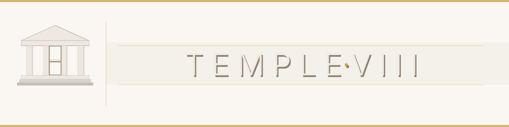

<div align="center">



<br/><br/>

[![Contributors][contributors-shield]][contributors-url]
[![Forks][forks-shield]][forks-url]
[![Stargazers][stars-shield]][stars-url]
[![Issues][issues-shield]][issues-url]
[![MIT License][license-shield]][license-url]
[](https://nullhack.github.io/temple8/coverage/)
[](https://github.com/nullhack/temple8/actions/workflows/ci.yml)
[](https://www.python.org/downloads/)
[](https://github.com/nullhack/temple8/releases)

**Test-driven agent orchestration. Any workflow. Any LLM. Zero lock-in.**

</div>

---

You ship features with AI assistants. The agent writes code, you review it, the spec still drifts. Tests pass but the feature doesn't match what stakeholders asked for. The review cycle is a black box.

**temple8 makes tests the contract and a state machine the router.** Test stubs are authored up front from the interview, simulated before any source exists, then built red → green → refactor one contract at a time. `flowr` routes every state change through the right agent with the right skills; CI (`ruff` / `pyright` / `mypy.stubtest` / `pytest`) is the enforcement backstop.

---

## Who is this for?

### Developers moving from vibe coding to agentic engineering

Vibe coding works for prototypes, breaks at scale. temple8 replaces "prompt and pray" with: BDD scenarios from interviews, title-based traceability from Example to test function, red-green-refactor enforced by default, a contract simulation gate that disconfirms the test surface before code, and three-tier review that catches what linters miss — including vacuous assertions that pass without asserting.

### Teams wanting structured agent orchestration without lock-in

Your team follows Scrum, Kanban, SAFe, or something custom. Orchestration should adapt to it, not the other way around. temple8 flows are YAML state machines you define, extend, or replace. Named specialists per state. No subscription, no vendor account, no code leaving your infrastructure. MIT licensed.

### Anyone evaluating test-driven development

You want to try it without a cloud IDE or monthly subscription. temple8 is a project template: clone it, run it locally with any LLM, see if the discipline works for your team. Already have a Python project? Use [agents-smith](https://github.com/nullhack/agents-smith) to add temple8's capabilities with one command.

---

## What it does

```
flowr check      →  inspect a state's owner, skills, and transitions
flowr next       →  see which transitions pass given your evidence
flowr transition →  advance to the next state with evidence
```

**Tests are the contract.** Test stubs (`.pyi`) are authored up front from the interview, marked `pending`, then simulated against the data model before any source exists. A test surface two implementations could satisfy — or none could — is caught here, not in review.

**State machines route the work.** YAML flows declare each state's owner, skills, input/output artifacts, and guard conditions. `flowr` validates every transition; no step is skipped or improvised.

**Agents are dispatched, not prompted.** Each state names its specialist — Product Owner, System Architect, Data Architect, Software Engineer, Reviewer, Release Engineer — and the skills/knowledge to load. Input/output contracts constrain scope; evidence gates prevent premature transitions.

**Branch per state.** `git: main` for project-phase work, `git: feature` for feature work. No ambiguity about where changes belong.

**One contract per cycle.** Build runs red → green → refactor → review → ship, one pending test at a time, until the backlog is empty.

---

## Quick start

### New project from the copier template

temple8 is a [copier](https://copier.readthedocs.io/) template. `copier copy` renders `pyproject.toml` + a fresh `README.md`, creates the package and the test skeleton, and hands you a new repo ready for the first `flowr session init` — without inheriting temple8's own git history.

```bash
uv tool install copier
copier copy gh:nullhack/temple8 my-project
cd my-project
curl -LsSf https://astral.sh/uv/install.sh | sh  # skip if uv is already installed
uv sync --all-extras
opencode && @setup-project                        # personalise for your project
uv run task test && uv run task lint && uv run task static-check
```

Answer the questionnaire (project and package name, description, author, version, repo URL, optional git reset, and which optional layers to keep — design knowledge + asset templates, and the `docs/research/` reference library). The `project-instantiator` agent and its `instantiate-project` skill (in `.opencode/`) guide the same flow end to end. They live in the template and are excluded from instances.

### Clone the template directly

```bash
git clone https://github.com/nullhack/temple8
cd temple8
curl -LsSf https://astral.sh/uv/install.sh | sh  # skip if uv is already installed
uv sync --all-extras
opencode && @setup-project                        # personalise for your project
uv run task test && uv run task lint && uv run task static-check
```

### Existing project

```bash
pip install agents-smith
smith clone                              # adds temple8's agents, flows, skills, and knowledge
```

---

## Commands

```bash
uv run task test              # full suite + coverage
uv run task test-fast         # fast, no coverage (use during TDD loop)
uv run task test-build        # full suite + HTML/coverage/hypothesis report
uv run task lint              # ruff check (dev: bug-catchers)
uv run task lint-merge        # merge: + SIM/RUF + ruff format
uv run task static-check      # pyright type checking
uv run task stubtest          # mypy.stubtest against the package stubs
uv run task validate-flows    # flowr validate on every flow YAML
uv run task strip-docstrings  # strip docstrings from a source .py (tdd select)
uv run task run               # run the app
```

---

## The pipeline

```
discover → explore → plan → build → deliver → shipped
```

| Subflow | What happens | Entry state |
|---|---|---|
| discover | interview funnel → glossary of ubiquitous language | `interview-general` |
| explore | ground external services in recorded vcrpy cassettes | `select-external-target` |
| plan | data model → test stubs → review → test bodies → source stubs → simulate | `model-data-schema` |
| build | one contract per cycle: red → green → refactor → review → ship | `select-build-target` |
| deliver | squash-merge to `dev`, regenerate docstrings, whole-suite gates | `merge-to-dev` |

`flowr` is the single router. Every state change runs through it. The state's contract is binding: every input artifact must exist before work starts; work writes only to the declared output artifacts. See `AGENTS.md` for the binding constraints and the driving loop.

---

## FAQ

### How is this different from Kiro?

Both identified the same pain points in AI-assisted development. The standards differ: Kiro uses EARS notation and property-based testing; temple8 uses BDD, TDD, and DDD with three-tier progressive review and a contract simulation gate that walks the test surface hop-by-hop before any source exists. Kiro is a cloud IDE on Bedrock. temple8 is a local project template with any LLM. MIT licensed, zero cost.

### How is this different from Cursor or Copilot?

Cursor and Copilot help write code. temple8 decides what to write, in what order, and what review it passes before shipping. They are the engine; temple8 is the map. Use both together.

### How does this relate to Claude Code or opencode?

Claude Code and opencode are general-purpose agent runners. temple8 gives them a process: YAML state machines, scoped agent roles, evidence-based transitions. Without temple8, they follow prompts. With it, they follow a workflow.

### Do I need to replace my existing tools?

No. temple8 is a project template: flows, agent definitions, skills, and knowledge files you drop into any Python project. Keep your editor. Bring your own LLM via opencode or a compatible agent runner. Already have a Python project? Use [agents-smith](https://github.com/nullhack/agents-smith) to add temple8's agents, skills, and flows with one command: `smith clone`.

### Is this only for software development?

The default flows cover software development (discovery, exploration, data modeling, TDD cycles, review). Any repeatable process with steps and conditions can be expressed as a flowr state machine: ops runbooks, compliance audits, content pipelines, incident response.

---

## Documentation

- **[Product Definition](https://nullhack.github.io/temple8/)**: product boundaries, users, and scope
- **[System Overview](https://nullhack.github.io/temple8/)**: architecture, domain model, module structure, and constraints
- **[Glossary](https://nullhack.github.io/temple8/)**: living domain glossary
- **`AGENTS.md`**: binding constraints and the state-driving loop
- **`.opencode/knowledge/`**: the methodology, requirements, software-craft, workflow, architecture, writing, and design reference layer

---

## License

MIT. See [LICENSE](LICENSE).

**Author:** [@nullhack](https://github.com/nullhack) · [Documentation](https://nullhack.github.io/temple8)

<!-- MARKDOWN LINKS -->
[contributors-shield]: https://img.shields.io/github/contributors/nullhack/temple8.svg?style=for-the-badge
[contributors-url]: https://github.com/nullhack/temple8/graphs/contributors
[forks-shield]: https://img.shields.io/github/forks/nullhack/temple8.svg?style=for-the-badge
[forks-url]: https://github.com/nullhack/temple8/network/members
[stars-shield]: https://img.shields.io/github/stars/nullhack/temple8.svg?style=for-the-badge
[stars-url]: https://github.com/nullhack/temple8/stargazers
[issues-shield]: https://img.shields.io/github/issues/nullhack/temple8.svg?style=for-the-badge
[issues-url]: https://github.com/nullhack/temple8/issues
[license-shield]: https://img.shields.io/badge/license-MIT-green?style=for-the-badge
[license-url]: https://github.com/nullhack/temple8/blob/main/LICENSE
